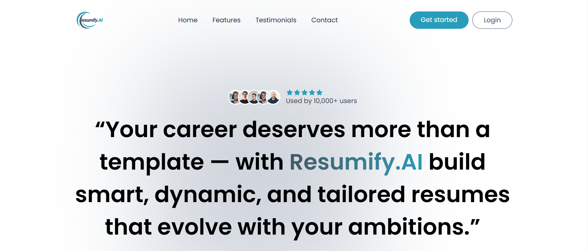
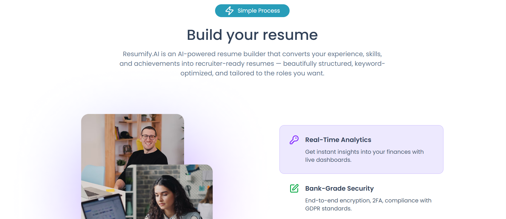
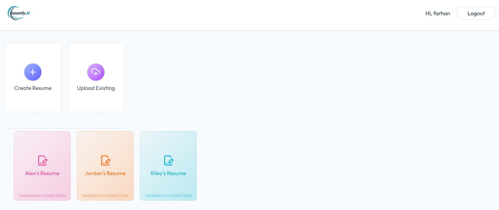
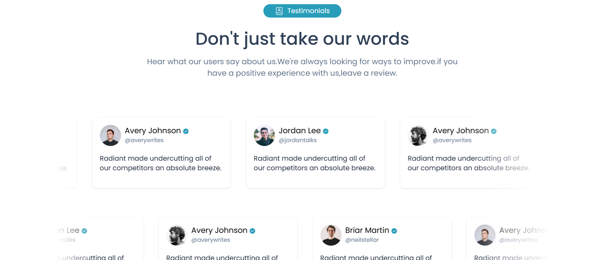

# 🧠 Resumify.AI

**Crafting Smarter Resumes with AI Precision.**  
Resumify.AI is an AI-powered resume builder that converts your experience, skills, and achievements into recruiter-ready resumes — beautifully structured, keyword-optimized, and tailored to the roles you want.

---

## 📘 Table of Contents
1. [About](#about)
2. [Features](#features)
3. [Demo / Screenshots](#demo--screenshots)
4. [Tech Stack](#tech-stack)
5. [Quickstart — Local Installation](#quickstart--local-installation)
6. [Usage Examples](#usage-examples)
7. [API Reference](#api-reference)
8. [Environment Variables](#environment-variables)
9. [Deployment](#deployment)
10. [Contributing](#contributing)
11. [License](#license)
12. [Contact](#contact)

---

## 🧾 About

**Resumify.AI** transforms raw career data into polished resumes using AI-driven parsing, content enhancement, and job-specific optimization.  
It supports multiple professional templates, ATS-friendly formatting, and export to PDF/Word — helping job seekers stand out effortlessly.

---

## 🚀 Features

- Parse LinkedIn profile or plain text into structured resume sections  
- AI-enhanced rewriting for impactful bullet points  
- Role-specific tailoring (e.g., Developer, Designer, Manager)  
- Multiple professional & ATS-friendly templates  
- Export resumes to **PDF** and **DOCX**  
- Save and manage multiple versions of resumes  
- Keyword optimization & job match scoring  
- Clean and responsive UI built for all devices  

---

## 🖼️ Demo / Screenshots

<p align="center">
  
</p>

<p align="center">
  
  
</p>

<p align="center">
  
  
</p>

---

## 🧩 Tech Stack

**Frontend:**
- React.js (Vite)
- Tailwind CSS / ShadCN UI
- Framer Motion (animations)

**Backend:**
- Node.js, Express.js
- MongoDB (Mongoose)
- OpenAI API (AI text generation)
- Puppeteer / html-pdf for PDF generation

**Other Tools:**
- Firebase Auth or JWT for Authentication
- Cloud Storage or AWS S3 for file hosting
- Render / Vercel for deployment

---

## ⚙️ Quickstart — Local Installation

```bash
# Clone the repository
git clone https://github.com/your-username/resumify.ai.git
cd resumify.ai

# Setup Backend
cd server
cp .env.example .env
npm install
npm run dev    # runs Express server at http://localhost:4000

# Setup Frontend
cd ../client
npm install
npm run dev    # runs React app at http://localhost:5173
